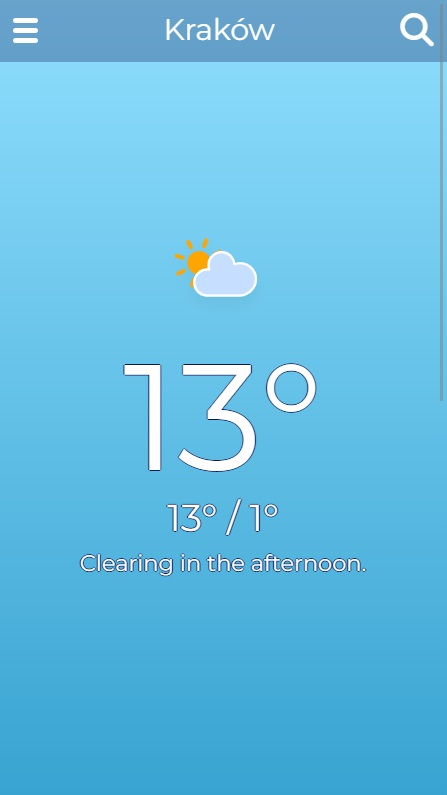
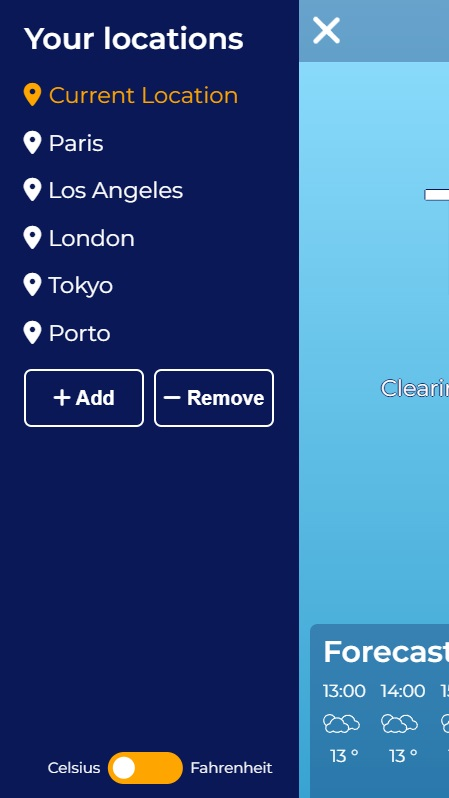
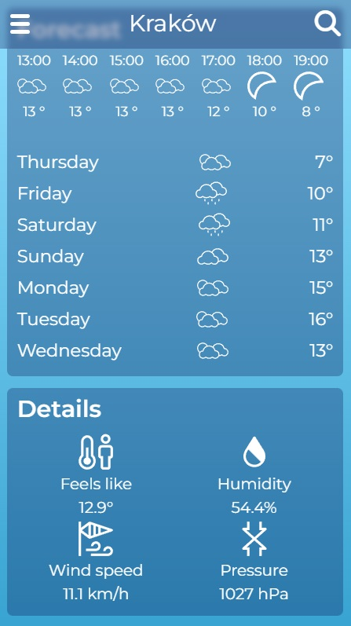
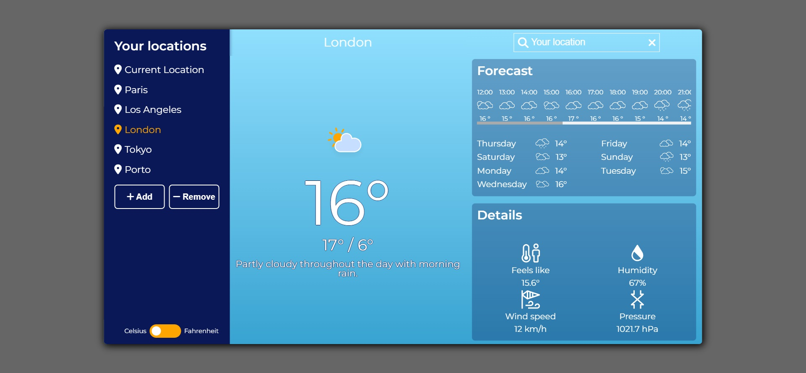

# In Case It Rains
Weather App

## Table of contents
* [General info](#general-info)
* [Technologies](#technologies)
* [Live demo](#live-demo)
* [Screenshots](#screenshots)

## General info
In Case It Rains is a weather app with a simple design.
What In Case It Rains:
* is easy to use
* shows the weather information like: current conditions, daily and hourly forecast, details
* shows the weather for your current location
* shows the weather for the locations of your choice
* allows to search location, add and remove from 'Your Locations' (also Local Storage)
* allows to choose units (Celsius or Fahrenheit)

Unfortunately git doesn't include all commits. I hadn't hidden API keys during development process and I have done it at the end of the development.

## Technologies
* HTML5
* CSS3
* Sass
* JavaScript
* OOP
* REST API
* Webpack

## Live demo
[Click here](http://www.in-case-it-rains.online/)

## Screenshots

